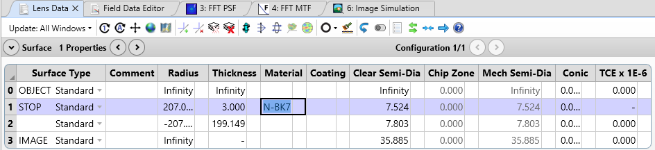
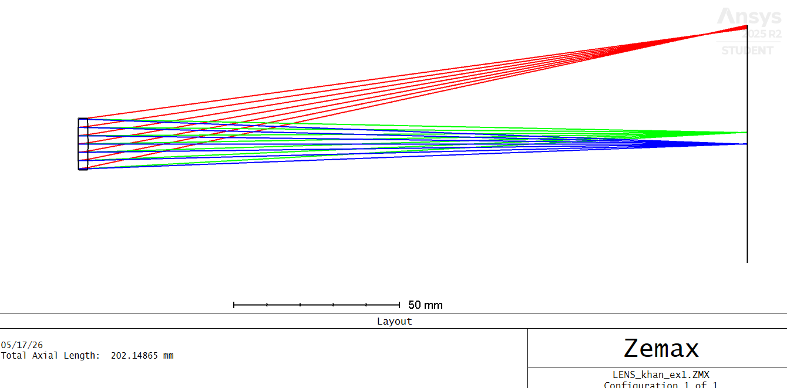
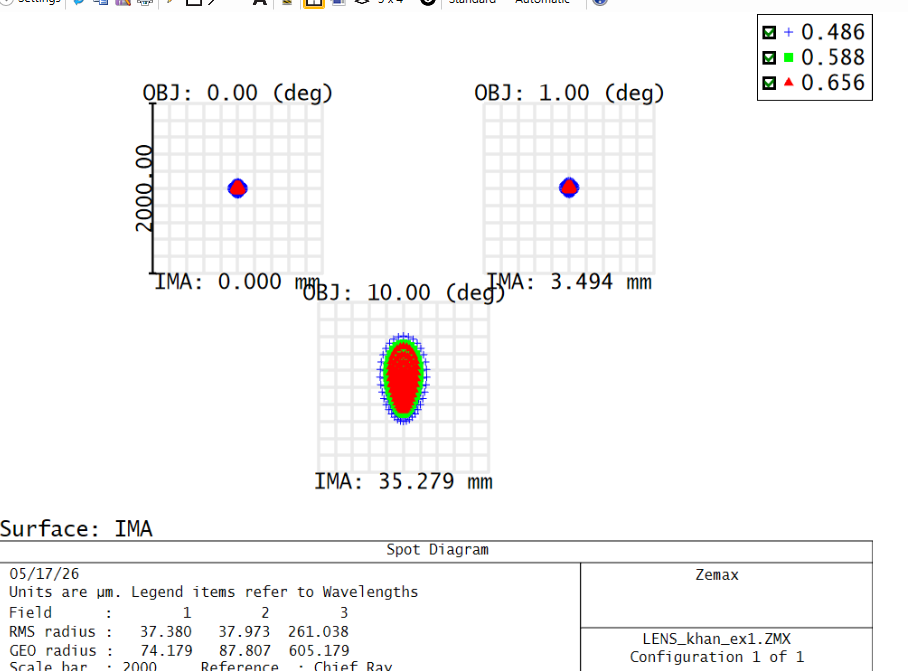
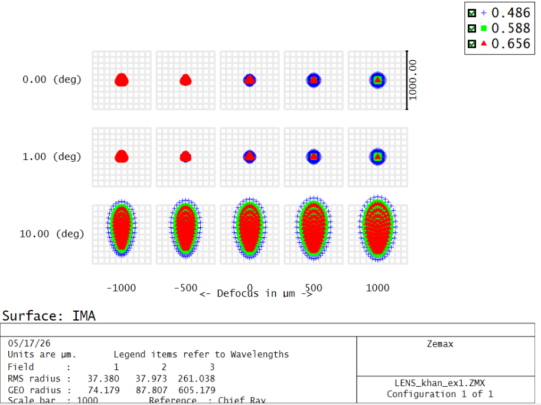
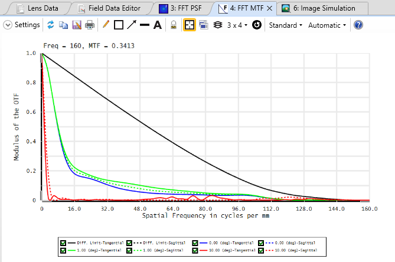

# Basic Lens Setup in Zemax OpticStudio

As a first step in learning optical system design in Zemax OpticStudio, I created a simple singlet lens setup using the Sequential Mode Lens Data Editor. The system consists of an object surface, a stop surface, a refractive lens made of N-BK7 glass, and an image surface.

The purpose of this setup was to study basic imaging performance and understand how different optical parameters affect spot formation and image quality.

---

## Lens Setup

---

## System Configuration

- Lens material used: **N-BK7**
- Sequential optical design
- Three wavelengths defined for polychromatic analysis
- Stop surface introduced to control aperture size
- Image surface used to observe focusing behavior

---

## Analysis Performed

After building the lens system, the following analyses were performed:

- Spot Diagram
- RMS Spot Radius
- Point Spread Function (PSF)
- Modulation Transfer Function (MTF)

The three wavelengths allowed observation of chromatic behavior and comparison of wavelength-dependent focusing at the image plane. The RMS spot radius was used as a metric to evaluate optical performance and image quality.

---

## Spot Diagram Analysis

As observed from the spot diagram, the rays corresponding to different wavelengths focus near the image plane with slight chromatic spread. The spot distribution provides insight into aberrations and focusing performance of the singlet lens system.

---

## FFT Point Spread Function (PSF)

The FFT PSF analysis was used to study the spatial distribution of light intensity around the focal point and evaluate diffraction behavior of the optical system.

---

## FFT Modulation Transfer Function (MTF)

The FFT MTF analysis was performed to evaluate the spatial frequency response and imaging capability of the lens system.

---

## Learning Outcomes

Through this project, I learned:

- Construction of a basic optical system in Zemax
- Influence of curvature, thickness, and material on focusing
- Multiwavelength optical analysis
- Interpretation of spot diagrams and RMS spot radius
- Basics of optical imaging performance evaluation
- Introduction to PSF and MTF analysis

---
## Next goal
- To learn to make the best use of MTF
- Make multiple lens system
- Learn to optimize the function

## Software Used

- Zemax OpticStudio
- Sequential Mode
- FFT Analysis Tools

---

## Khan

Mohammad Anas Khan
Master in Photonic Engineering  
Université Jean Monnet Saint-Étienne
